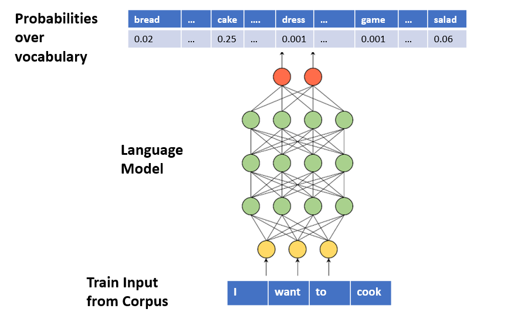
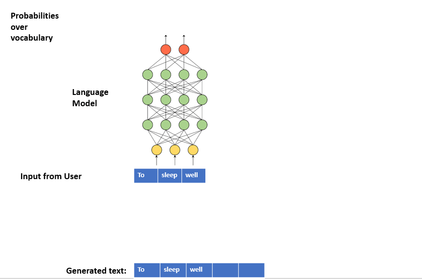
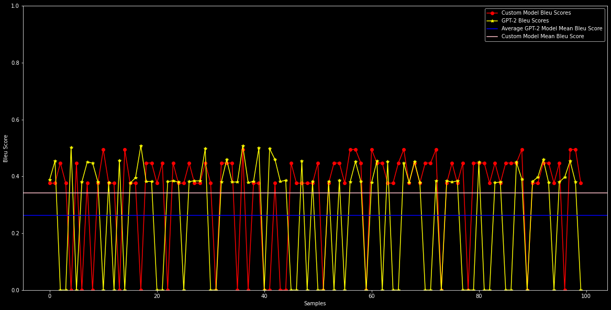

# Text Generation using Attention Mechanism and Fine Tuning GPT2

### What is text generation in AI? 
Text generation is a subfield of natural language processing (NLP). It leverages knowledge in computational linguistics and artificial intelligence to **automatically generate natural language texts**, which can satisfy certain communicative requirements.\
\
In general:

* We first **train** a Language Model (**LM**) with a corpus. LM learns the statistical distributions of the next token for a given token sequence from the corpus.\

* In text generation, LM works in a loop:
* We provide initial random text (seed) to LM.
* LM predicts the next token.
* We concatenate this token to the seed and provide this sequence as the new seed to LM.\


 
 ### Techniques used :-
* #### Word Level Text Generation
     A Language Model can be trained to generate text **word-by-word**. In this case, each of the **input** and **output** tokens is a **word**. Moreover, Language Model outputs a **probability distribution** over **vocabulary**.
* #### Text Preprocessing
  - Replace '--' with a space ' '.
  - Split into tokens by white space.
  - Remove punctuation from each token.
  - Remove remaining tokens that are not alphabetic.
  - Make lower case.
  - Organize into sequences of tokens i.e. here we create lines of
        length 51 from starting to the end token of the cleaned do.
  
  - Now we tokenize each unique token and convert each line as numpy arrays using keras.Tokenizer().fit_to_texts(lines).
  - Now we take the first 50 tokens of each line as input sequence and 51th token as the target token to be predicted.
  - We One Hot Encode the 51th token i.e. y.

  Our Data is now ready to be fed into the custom model that we will build.

* #### Model 
  - We build an Attention class first and return the context vector calculated.
  - We first add Input Layer which takes input of dim 50.
  - Next we add an Emebedding layer and returning word embeddings of size 50 for each word.
  - We then add 2 stacked vanilla LSTMs having 100 units each.
  - Then we add the custom attention layer defined above.
  - Finally we add a Dense layer followed by an output Dense layer having vocab_size units.
  - Comipled our model using Categorical Cross Entropy loss and Adam Optimzer.
  We train our model for 100 epochs.

* #### Inference

  We define a function which takes an Input sequence of variables length and length of next sentence to be predicted (here we pass 50) and then we tokenize the 
  input sentence pass it to the model to predict the next word and map the value to its
  key value from reverse_token_map dictionary, add it to the previous sequence and pass this as an input sequence with length of next tokens produced  = current_length -1 and repeat the process
  till we generate the next 50 tokens.\
  Now we return the entire sentence i.e. Input sentence + Predicted Sentence.

* #### Fine-Tuning GPT-2
  We also fine-tune using GPT-2 (small) having 174M parameters.\
  This needs the gpt-2-simple to be installed and then we fine tune the model based on certain parameters.

### Testing our model
Now, we take 100 samples from the document each of length 50 and predict
the next 50 words we see calculate the Blue Score between the actual sentence
and predicted sentence and we see that GPT2 is giving less mean Bleu Score
this may be due to unavailability of enough data or tweaking few parameters while 
fine - tuning might help.




## Deployment

To deploy this project run

```bash
  pip install tensorflow
```
```bash
  pip install gpt-2-simple
```
```bash
  pip install keras
```


